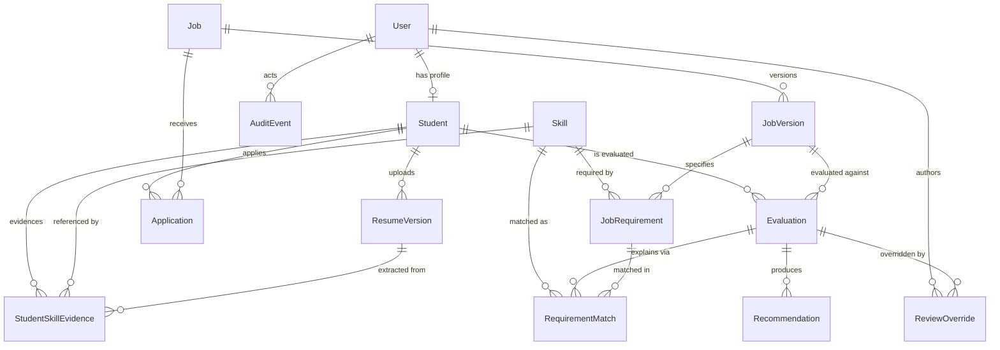

# ER Model — Authoritative Schema Reference

Source of truth: `prisma/schema.prisma` (baseline migration: `prisma/migrations/0_init/`).
This document describes the model as deployed; the generic phase docs in this folder predate it.

## Entity-relationship diagram



## Key invariants (DB-enforced)

| Constraint | Table | Purpose |
|---|---|---|
| `@@unique([studentId, jobId])` | applications | one application per student per job |
| `@@unique([jobId, version])` | job_versions | monotonic version history per job |
| `@@unique([studentId, skillId])` | student_skill_evidence | one evidence row per skill |
| `@unique email`, `@unique rollNumber`, `@unique canonicalName`, `@unique storageKey` | users / students / skills / resume_versions | identity keys |

## Indexes (hot paths)

| Index | Query it serves |
|---|---|
| `evaluations(student_id, created_at)` | student's evaluation history, newest first |
| `evaluations(job_version_id, overall_score)` | ranked candidate list per job version |
| `evaluations(snapshot_hash)` | idempotent queue lookup |
| `applications(job_id, status)` | admin candidate/application filters per job |
| `applications(status, applied_at)` | global application list filtered by status |
| `audit_events(resource_type, resource_id, created_at)` | audit trail per resource |
| `audit_events(created_at)` | global audit log, newest first |
| `requirement_matches(match_state)` | skill-gap analytics (`MISSING` group-by) |

## Evaluation snapshot & idempotency contract

`Evaluation.inputSnapshot` (JSON) freezes everything the engines saw at queue time:
student profile fields (CGPA, backlogs, department, program), the skill list with
confidences, and the job version's requirements. `snapshotHash` is
`sha256(JSON.stringify(hashBase))` over that snapshot **excluding timestamps**
(`lib/services/evaluations.service.ts`).

Queueing rules:
- Same `snapshotHash` already evaluated → the existing evaluation is returned; no new row.
- Any input change (skill added, CGPA updated, new job version) → new hash → new evaluation.
- Evaluations are never mutated after completion; admin corrections go through
  append-only `ReviewOverride` rows instead.

## Resume state machine

`ResumeVersion.state` (`ResumeState` enum):

```
UPLOADED → QUARANTINED → SCANNED → EXTRACTING → EXTRACTED
                │                        │
                └────────────────────────┴──→ NEEDS_MANUAL_REVIEW | FAILED
any state ──→ DELETED (soft delete via deletedAt)
```

Terminal states: `EXTRACTED`, `FAILED`, `DELETED`. `NEEDS_MANUAL_REVIEW` waits on
an admin action. Uploads currently enter at `UPLOADED`; scanning/extraction states
are reserved for the resume-processing pipeline.

## Append-only tables

`review_overrides` and `audit_events` have no update/delete paths in the app —
history is immutable by convention and every override also writes an audit event.
